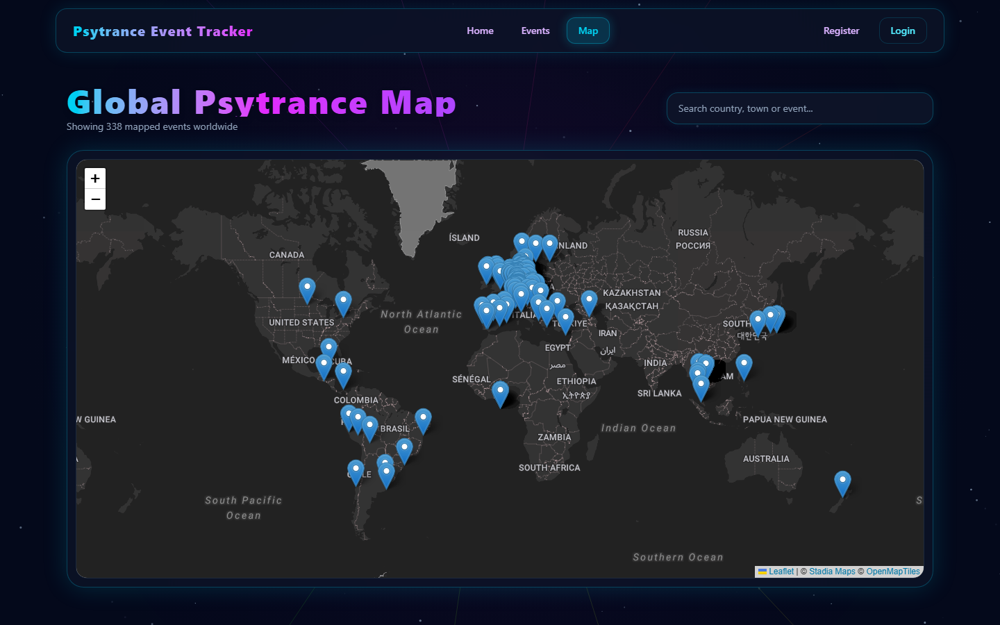

# PsyTrance Event Tracker

[](https://github.com/Peconjii/psytrance-tracker/actions/workflows/ci.yml)

A web app for discovering psytrance festivals and parties around the world: browse and filter a few hundred
upcoming events, explore them on a world map, save favorites and review the ones you went to.

This repository is the **React frontend**.
**Backend (Java / Spring Boot):** [Peconjii/psytrance-tracker-backend](https://github.com/Peconjii/psytrance-tracker-backend)




## Features

- **Event browser with infinite scroll.** Events load 24 at a time as you scroll. Search by name or town and
  filter by country, subgenre and timeline (upcoming, this weekend, past). Filtering and paging happen on the
  backend, and text inputs are debounced so typing doesn't send a request per keystroke.
- **World map.** Every event with coordinates as a pin (Leaflet). Searching highlights matching pins and flies
  the map to the first match.
- **Event cards.** Current weather at the venue (Open-Meteo), a mini-map, reviews with average rating, and
  sharing to WhatsApp or Telegram.
- **Accounts.** Register and log in (JWT), reset a forgotten password by email, save favorite events, and see
  your profile with activity stats and the reviews you've written. Favorites and profile pages are protected
  routes.
- **Animated background.** A canvas visualizer that cycles through five patterns (flower, spiral, burst,
  wormhole, helix).

## Tech stack

- **React 19** with **Vite**
- **React Router 7**
- **Tailwind CSS 4**
- **Axios**
- **Leaflet** / **React-Leaflet**
- **Docker** + **nginx** for the production build

## Getting started

**Easiest: Docker.** The [backend repo](https://github.com/Peconjii/psytrance-tracker-backend) has a Docker
Compose file that starts the database, backend and this frontend together. Clone both repos next to each other
and run `docker compose up --build` in the backend folder, then open `http://localhost:5173`.
In Docker the frontend is built once and served by nginx (see `Dockerfile` and `nginx.conf`).

**For development** with hot reload, run the backend on `http://localhost:8080` (see its README) and start
the dev server here:

```bash
npm install
npm run dev
```

Then open `http://localhost:5173`.

| Script | What it does |
|---|---|
| `npm run dev` | Start the dev server with hot reload |
| `npm run build` | Production build into `dist/` |
| `npm run preview` | Serve the production build locally |
| `npm run lint` | Run ESLint |

## Project structure

```
src/
├── api/          # Axios instance (adds the JWT) and API calls
├── components/   # Event cards, the infinite event feed, maps, reviews, navbar, background
├── context/      # AuthContext (user + token), FavoritesContext
├── hooks/        # useDebouncedValue
└── pages/        # Home, Events, GlobalMap, Favorites, Profile, Login, Register, ForgotPassword, ResetPassword
```

### How the event list works

`EventFeed` keeps the events loaded so far and asks the backend for the next page when an invisible
"sentinel" element below the grid comes near the screen (`IntersectionObserver`). Each filter combination
gets its own React `key`, so changing a filter throws the old list away and starts again from page 0.
Requests that are still running when filters change are cancelled with an `AbortController`, so late
responses never end up in the wrong list.

## Data sources

- Events: [Goabase](https://www.goabase.net) (through the backend)
- Weather: [Open-Meteo](https://open-meteo.com)
- Maps: [OpenStreetMap](https://www.openstreetmap.org) data, [Stadia Maps](https://stadiamaps.com) tiles,
  [Nominatim](https://nominatim.org) geocoding
